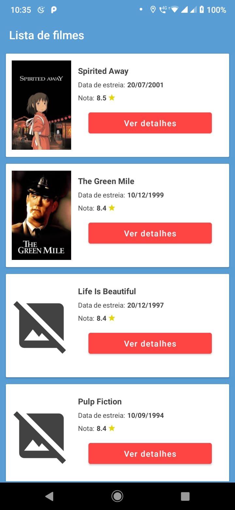
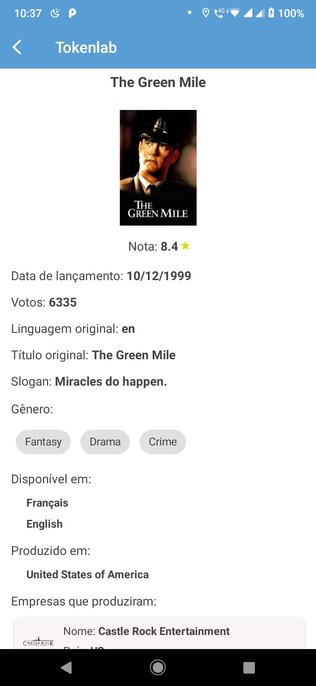

Este app é o desafio de estágio em Desenvolvimento Android da empresa Tokenlab. Ele é composto por 2 telas:

1. Tela de listagem dos filmes:
Nessa tela foi feita uma requisição para obter a lista de filmes

2. Tela de detalhes de um filme:
Nessa tela foi feita uma nova requisição para obter os detalhes de um filme clicado na tela anterior

##

 
